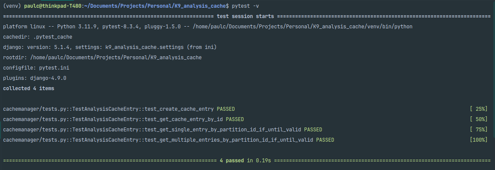

# k9_analysis_cache

## Description

`k9_analysis_cache` is a Django project designed to implement a model that interacts with a MySQL database. The primary goal of this project is to create a Django model that allows for efficient access to analysis cache data. The model includes a method to bulk load records based on the `partition_id` field. Additionally, unit tests have been implemented to ensure the proper functionality of the create, read, and bulk read methods.

The `AnalysisCacheEntry` model has been implemented to access the `analysis_cache` table that runs on a MySQL server. To simulate the server, a local access configuration has been set up using Docker. The tests can be found in the Django app located at `cachemanager/tests.py`, and here is a screenshot of the results of the executed tests:



## Requirements

- Python 3.11 or higher
- Django 5.1.4
- MySQL installed or
- Docker (for running MySQL in a container)
- pip

## Installation

1. **Clone the repository**:
   ```bash
   git clone https://github.com/PaulCabeza/k9_analysis_cache.git
   cd k9_analysis_cache
   ```

2. **Create a virtual environment** (optional but recommended):
   ```bash
   python -m venv venv
   source venv/bin/activate 
   ```

3. **Install the dependencies**:
   ```bash
   pip install -r requirements.txt
   ```

4. **Set up the MySQL database**:
   You can run a MySQL container using Docker. Use the following command to start a MySQL container:
   ```bash
   docker pull mysql:latest
   docker run --name mysql-container -e MYSQL_ROOT_PASSWORD=my_secret_password -d -p 3306:3306 mysql:latest
   ```

5. **Create a database**:
   After starting the MySQL container, connect to it and create a database:
   ```bash
   docker exec -it mysql-container mysql -u root -p
   # Enter the password: my_secret_password
   CREATE DATABASE k9_analysis;
   ```

6. **Configure the database settings**:
   Update your `.env` file or directly in `settings.py` with the following database configuration:
   ```plaintext
   DB_NAME=k9_analysis
   DB_USER=root
   DB_PASSWORD=my_secret_password
   DB_HOST=localhost
   DB_PORT=3306
   ```

7. **Run migrations**:
   ```bash
   python manage.py migrate
   ```

8. **Create a superuser** (optional):
   ```bash
   python manage.py createsuperuser
   ```

9. **Run the server**:
   ```bash
   python manage.py runserver
   ```

## Project Structure

- `cachemanager/`: Contains the model logic and tests.
- `k9_analysis_cache/`: Django project configuration.
- `tests.py`: Contains tests for the model and cache functionality.

## Testing

To run the unit tests, ensure your test database is configured and execute:
```bash
pytest -v
```
